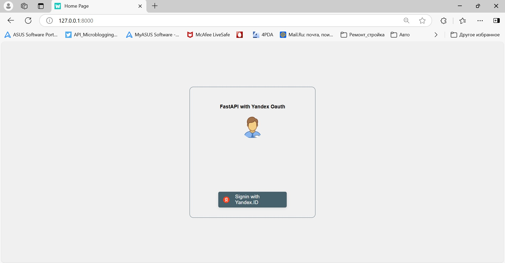
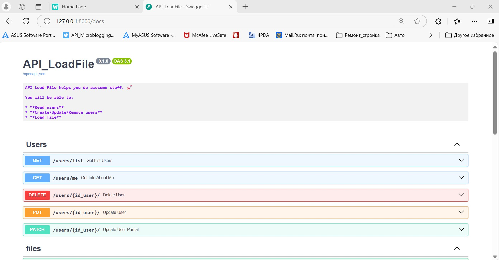
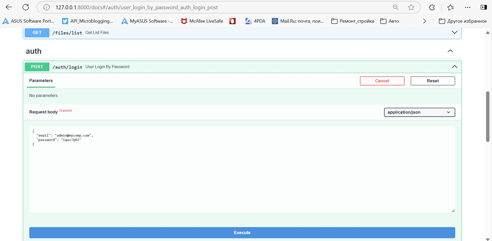
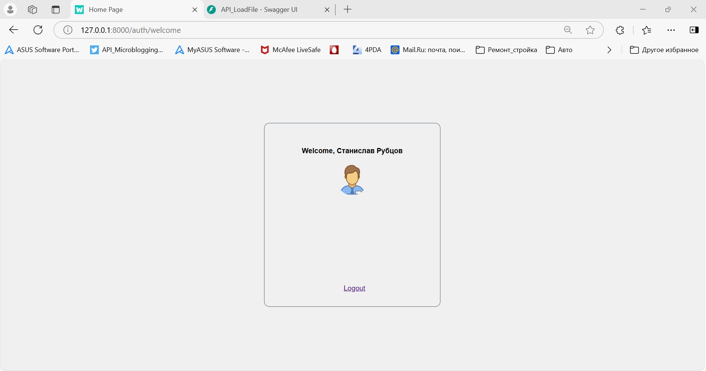

# API для загрузки файлов на сервер
### Реализация бэкенд сервиса для работы с файлами

Используемые технологии:
- Фреймворк: FastAPI
- База данных: PostgreSQL
- ORM: SQLAlchemy
- Аутентификация: JWT
- Управление миграциями: Alembic
- Тестирование: Pytest

Реализованный функционал:
- аутентификация через Яндекс или по паролю
- авторизация пользователей с использование JWT (access, refresh token)
- получение администратором списка пользователей
- изменение пользователем своих данных
- загрузка аудио-файлов на сервер
- получение пользователем списка своих файлов

## Правила использования

Пользователи разделяются  на: администраторов и пользователей.

Администратор может создать/удалить/обновить пользователя, получить список пользователей.
Пользователь может получить данные о себе, обновить свои данные, загрузить файлы и получить их список.

## Запуск проекта

Для развертывания проекта используется `Docker Compose`.

В проекте используется env-файл, который хранится в репозитории (проект тестовый):

Чтобы запустить проект используем команду:
```
docker compose up -d
```

При первом запуске проекта необходимо выполнить миграции базы данных с помощью Alembic используя команду:

```
docker compose exec app alembic upgrade head
```
а также создать тестовых пользователей:
```
docker compose exec app docker/create_users.sh
```
Утилита создаёт администратора с email: admin@mycomp.com и паролем: 1qaz!QAZ,
а также пользователя с email: user1@mycomp.com и паролем: 2wsx@WSX.


Стартовая страница проекта [http://127.0.0.1:8000](http://127.0.0.1:8000).


Страница с интерактивной документацией [http://127.0.0.1:8000/docs](http://127.0.0.1:8000/docs).


Перед началом работы необходимо авторизоваться.
Администратор использует авторизацию по паролю. 



Для авторизации через сервис Яндекса используем web-интерфейс.


Затем можно начать работу с пользователями и файлами. 

P.S. Проверить с помощью API авторизацию через Яндекс не получается, мешают CORS ограничения на стороне Яндекс (на бекенде все разрешения включены).

## Тестирование проекта

Для тестирования проекта необходимо создать тестовую базу командой:
```
docker compose -f docker-compose-test.yml up -d
```

Перейти в каталог с тестами:
```
cd tests
```

Для тестирования раздела работы с пользователями:
```
pytest -v test_user.py
```


## Licence

Author: Stanislav Rubtsov